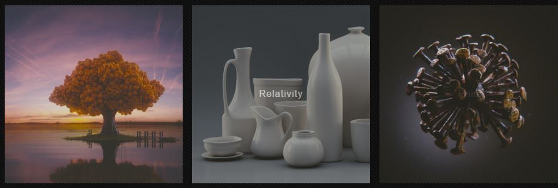
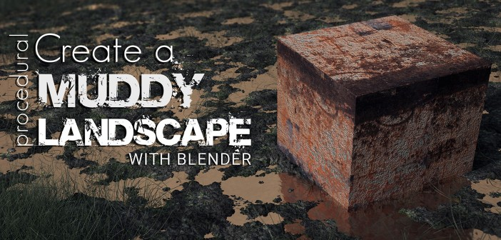
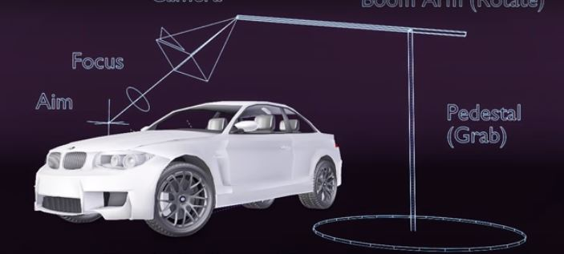
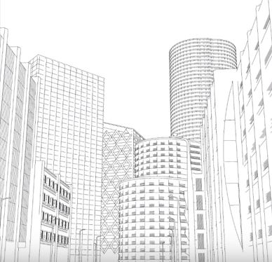
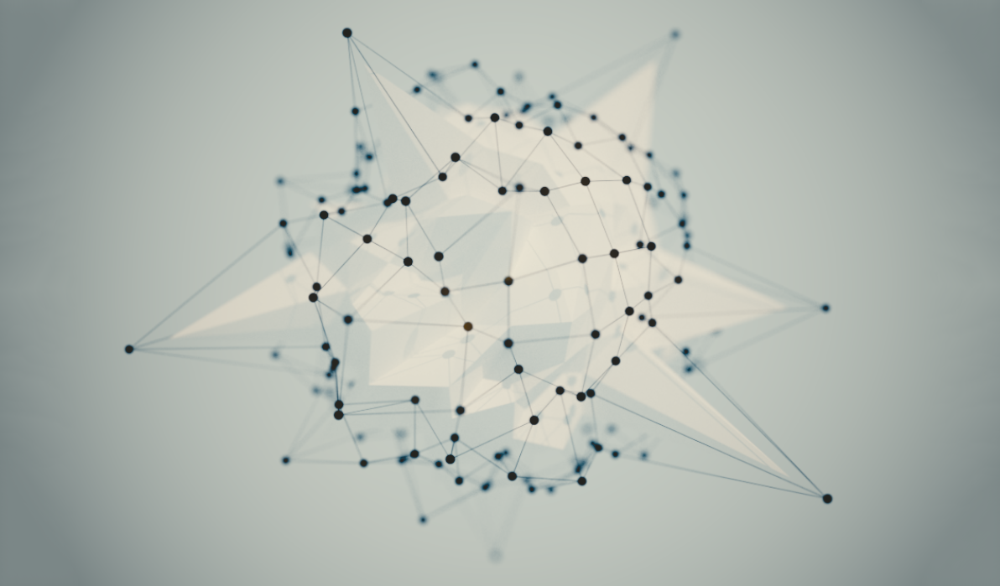
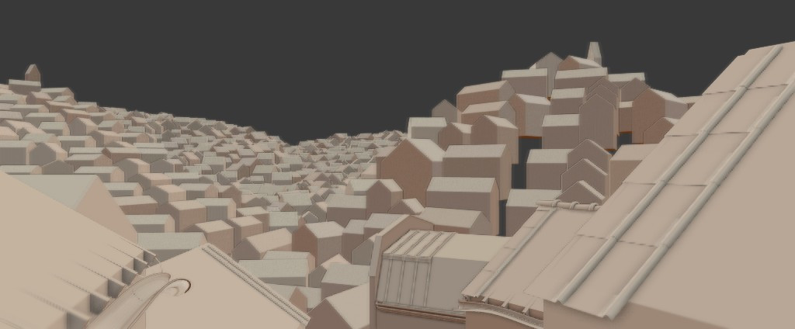

blackjuice's Blender experience

version: **Blender 2.78**

# Notes

This Markdown page is available at:

* [blackjuice's GitHub](https://github.com/blackjuice/sectionAlpha/tree/master/Blender)
* [saguahollic's wordpress blog](https://saguahollic.wordpress.com/)

<a name="content"></a>
# Content

* [Documentation](#documentation):    Official doc for Blender;
* [Computer specs](#specs):           Blackjuice's desktop specs;
* [Setup](#setup):                    setting up AMD GPU on Blender;
* [Library](#library):                Links for free models, textures, favorite artists;
* [Help table](#help-table):          Frequently used hotkeys listed on table;
* [Addons](#addons):                  Interesting addons and more info;
* [Other Softwares](#extrasoftwares): Such as Substance Painter;
* [Top arts](#topart):                Pro arts out there;
* [PDM](#pdm):                        Learned material for project development;


<a name="documentation"></a>
## Documentation

Official doc for Blender:

* [Blender Hotkey](http://wiki.blender.org/index.php/Doc:2.4/Reference/Hotkeys/All)
* [Blender manual Sphinx](https://www.blender.org/manual/contents.html)

Cheatsheet

* From http://www.giudansky.com/


[> back to main Content](#content)


<a name="specs"></a>
## Computer specs

Blackjuice's desktop specs:

| spec | info |
|:----:|:----:|
| Motherboard | Gigabyte Technology Co, Ltd. GA-970A-UD3                  |
| Processor   | AMD FX(tm)-8320 Eight-core Processor 3.50 GHz             |
| Video card  | AMD Radeon HD 7800 Series (Club 3D HD 7870 XT jokerCard)  |
| RAM         | 8GB                                                       |
| OS          | Windows 10 Home                                           |
| System      | 64-bit                                                    |

GPU ([check me](https://www.techpowerup.com/gpudb/b762/club-3d-hd-7870-xt-jokercard)):


[> back to main Content](#content)


<a name="setup"></a>
## Setup

Setting up AMD GPU on Blender: OpenCL Cycles on Blender **2.7X** + AMD GPUs

* Update OpenCL drivers [here](http://support.amd.com/en-us/kb-articles/Pages/OpenCL2-Driver.aspx)
* At main Blender folder, at Command prompt, enter:

    set CYCLES_OPENCL_TEST=all

* (**HINT**) To enter Disk Local "X":

    $ d:

* Then run Blender.

[> back to main Content](#content)


<a name="library"></a>
## Library

List of addresses containing free models, textures, favorite artists etc for reference:

* **Free models**:
  * [tf3dm.com](http://tf3dm.com/);
  * [cgtrader](http://www.cgtrader.com/);
  * [BenSimonds basemesh body](http://bensimonds.com/2011/07/31/basemeshes/).

* **Textures**:
  * [Blender Cloud: Textures Library](http://www.blendernation.com/2015/12/27/blender-cloud-textures-library/).

* **Artists**:
  * Reynante Martinez
  [](http://www.reynantemartinez.com/tutorials.html)
  * Blender Guru
  [](http://www.blenderguru.com/)

* **News**:
  * [Blender Nation](http://www.blendernation.com/);

[> back to main Content](#content)


<a name="help-table"></a>
## Help table

Desperate times calls for desperate measures.

List:

* [common](#common)
* [hints](#hints)
* [camera](#camera)
* [wheel design](#wheel_design)
* [background](#background)

[> back to main Content](#content)

| tag | hotkey | function | comment | source |
|:---:|:-------|:---------|:-------:|:------:|
| -   | `H`         | Hide   | - | - |
| -   | `Alt + H`   | Unhide | - | - |
| -   | `Ctrl + J`  | Join   | - | - |
| -   | `P`         | Unjoin | - | - |
| -   | `Shift + Ctrl + Alt + C`| Recenter pivot | Select **Origin to Geometry**. | [LL](http://blender.stackexchange.com/questions/14294/how-to-recenter-an-objects-origin) |
| -   | `Ctrl + U`  | Save startup | `File > Load Factory Settings` to reset | - |
| -   | `X`         | Dissolve Edges | Drop down "X" menu to select `Dissolve Edges`, which deletes extra edges without deleting faces | - |
| hint | -        | - | Switch to **edit mode** after .obj import | [LL](http://blenderartists.org/forum/showthread.php?127550-newbie-can-t-switch-to-edit-mode-after-obj-import) |
| -     | `Shift + D` | Duplicated        | - | - |
| wheel | `Alt + D`   | Duplicated Link   | - | - |
| wheel | `Ctrl + M`  | Mirroring         | - | - |
| wire  | `Alt + R`   | Multiply object around cursor, on `Edit mode`| awesome at making wire design | [EnigmaToots](https://www.youtube.com/watch?v=SE_F76g1qB0) |
| camera      | - | Change camera lens | Select 1st the camera, then at the editor menu, there is an filming device icon called Object Data. | [LL](http://wiki.blender.org/index.php/Doc:2.4/Manual/Render/Camera/Depth_Of_Field)|
| background  | - | `T` | Add background reference image | Activate `Properties Shelf` with the `T` key. At `Background Images`, click `Add Image` | - |

[back to Help Table](#help-table)


<a name="addons"></a>
## Addons

The following table contains favorite addons.

| name | author | comment |
|:------:|:--------:|:-------:|
| [Quick preferences](http://blenderartists.org/forum/showthread.php?223293-QuickPrefs-Access-from-side-panel-to-Lighting-Presets-amp-often-changed-preferences) | Sean Olson (LiquidApe) | recommended by masterxeon1001 |
| [Auto mirror](http://blenderaddonlist.blogspot.com.br/2014/07/addon-auto-mirror.html) |  Lapineige | recommended by masterxeon1001 |
| [BoolTool](http://www.blendernation.com/2014/05/14/add-on-booltool/) | Vitor Balbio | main tool for cutting feature on HardOps |
| [Screencast Key Status](https://wiki.blender.org/index.php/Extensions:2.6/Py/Scripts/3D_interaction/Screencast_Key_Status_Tool) | Paulo Gomes, Bart Crouch, John E. Herrenyo, Gaia Clary, Pablo Vazquez | display key pressed |
| [Mira Tools](https://github.com/mifth/mifthtools/tree/master/blender/addons/mira_tools) | mifth | recommended by masterxeon1001 |
| [MeasureIt](https://github.com/Antonioya/blender/tree/master/measureit) | Antonioya | [youtube video for tutorial](https://www.youtube.com/watch?v=R0jCdCoaRvs&feature=youtu.be) |
| [HardOps + BoxCutter](https://gumroad.com/masterxeon1001) | masterxeon1001 | ultimate tool |
| [Blender 2.7x XPS Tools 1.1](http://johnzero7.deviantart.com/journal/Blender-2-7x-XPS-Tools-1-1-485668690) | johnzero7 | XPS to Blender, a XNA model import feature in Blender |

More info on addons

### XPS to Blender 2.7x [(source here)](http://johnzero7.deviantart.com/art/XPS-to-Blender-2-7x-Blender-internal-the-easy-way-489500171)

* [Download XPS Tools for Blender 2.7x](http://johnzero7.deviantart.com/journal/Blender-2-7x-XPS-Tools-1-1-485668690)

Reference

| source | info |
|:------:|:----:|
| [johnzero7](http://johnzero7.deviantart.com/gallery/) | Blender/XPS guide |
| [irokichigai01](http://irokichigai01.deviantart.com/) | xnalara/xna mesh ascii good models |

----------------------------------------------------------------------------------------------

[> back to main Content](#content)


<a name="extrasoftwares"></a>
## Other softwares

* Alternatives for **Substance Painter** (US$ 149):
    * Blacksmith 3D (http://blacksmith3d.com/)
    * 3D coat (http://3dcoat.com/home/)
    * MARI (http://www.thefoundry.co.uk/products/mari/)

So far, the Substance Painter is the cheapest option here.

[> back to main Content](#content)


<a name="topart"></a>
## Top Arts

* https://www.cgtrader.com/gallery/project/buggy-for-apocalypse


* https://www.cgtrader.com/gallery/project/harley-davidson-xr1200x


* https://www.cgtrader.com/gallery/project/robot-series-105


[> back to main Content](#content)


<a name="pdm"></a>
## PDM

Project Development Materials.

* PDM001: [Delete multiple material](#PDM001);
* PDM002: [PNG background transparency](#PDM002);
* PDM003: [Set-up perspective view based on ref img](#PDM003);
* PDM004: [11 tips for speeding up rendering cycles](#PDM004);
* PDM005: [Selecting linked vertices](#PDM005);
* PDM006: [Multiple addons using the same name](#PDM006);
* PDM007: [Create a Muddy Landscape in Blender](#PDM007);
* PDM008: [Why and How to Use a Camera Rig](#PDM008);
* PDM009: [Blender Freestyle for Background Line Art](#PDM009);
* PDM010: [Motion](#PDM010);
* PDM011: [Low-poly modeling for high-poly rendering](#PDM011);
* PDM012: [Turning your blend file into a asset library](#PDM012);
* PDM013: [Blend Library](#PDM013);
* PDM014: [How to make a 3D model of the hedge](#PDM014);
* PDM015: [LEARNING MESH TOPOLOGY COLLECTION and SPEED SCULP](#PDM015);
* PDM016: [How to organize 3D Projects](#PDM016);
* PDM017: [Heightmap Terrain](#PDM017);
* PDM018: [Compositing](#PDM018);

[> back to main Content](#content)


<a name="PDM001"></a>
### PDM001: Can I delete all materials of all objects in a scene quickly?

Enable it in the `User Preferences > Addons`, select all objects `A`, hit `Q` over 3D View and chose **Remove Material Slots**:


Then use script:

```
python
    import bpy

    for ob in bpy.context.selected_editable_objects:
        ob.active_material_index = 0
        for i in range(len(ob.material_slots)):
            bpy.ops.object.material_slot_remove({'object': ob})
```

[> back to PDM](#pdm)


<a name="PDM002"></a>
### PDM002: Can Blender render pngs with the background transparent?

[Click here](http://blender.stackexchange.com/questions/1303/can-blender-render-pngs-with-the-background-transparent) for the source content.

At **CYCLES**:

* At ``Properties Editor > Render Context > Output Panel``, choose ``RGBA``;
* At ``Properties Editor > Render Context > Film Panel``, check ``Transparent``.


At **Blender Render**:

* At ``Properties Editor > Render Context > Output Panel``, choose ``RGBA``;
* At ``Properties Editor > Render Context > Shading Panel/OpenGL Render``, choose ``Alpha Transparent type``.


[> back to PDM](#pdm)


<a name="PDM003"></a>
### PDM003: How to set-up the perspective view based on a reference image?

[Click here](http://blender.stackexchange.com/questions/9328/how-to-set-up-the-perspective-view-based-on-a-reference-image) for the source content.

[> back to PDM](#pdm)


<a name="PDM004"></a>
### PDM004: At boundlessblending: “11 crazy tweaks to speed up cycles”

11 useful tips on speeding up your rendering on cycles!

What I always thought about doing it but never really did it was to use render layers to distribute calculations. Is really logical to think that rendering all layers together is more expensive than rendering each one separately. But for some time, I thought it wasn’t.

[Click here](https://boundlessblending.blogspot.com.br/2016/04/blender-fast-rendering.html) for the source content.


<a name="PDM005"></a>
### PDM005: Selecting linked vertices

At menu in Edit mode, go `Select > Edge Loops`.


<a name="PDM006"></a>
### PDM006: Multiple addons using the same name

To Toggle console when this message pops up:

    Multiple addons using the same name found!
    likely a problem with the script search path.
    (see console details)

Go `Window > Toggle System Console`.

[> back to PDM](#pdm)


<a name="PDM007"></a>
### PDM007: [Create a Muddy Landscape in Blender](http://www.blendernation.com/2016/01/09/create-muddy-landscape-blender/)

[](https://www.youtube.com/watch?time_continue=469&v=ibLBRxBC498)

[> back to PDM](#pdm)


<a name="PDM008"></a>
### PDM008: [Why and How to Use a Camera Rig](http://www.blenderhd.com/tutorial/why-and-how-to-use-a-camera-rig/)

[](https://www.youtube.com/watch?v=H7CISQFl7kA)

[> back to PDM](#pdm)


<a name="PDM009"></a>
### PDM009: [Blender Freestyle for Background Line Art](http://www.blendernation.com/2015/12/29/blender-freestyle-background-line-art/)

[](https://www.youtube.com/watch?v=2PoElEZbdwk)

[> back to PDM](#pdm)


<a name="PDM010"></a>
### PDM010: Motion

[](http://www.matthewinglis.com/tutorials/lowpolyabstracttutorial.aspx)

[> back to PDM](#pdm)


<a name="PDM011"></a>
### PDM011: Low-poly modeling for high-poly rendering

[](http://www.bjobernis.fr/news/post/displace-and-groups-modeling-tip-en)

[> back to PDM](#pdm)


<a name="PDM012"></a>
### PDM012: Turning your blend file into a asset library

Follow [link](http://www.blendernation.com/2016/03/05/turning-blend-file-asset-library/)

[> back to PDM](#pdm)


<a name="PDM013"></a>
### PDM013: Blend Library - Asset manager for material, objects and nodes

Follow [link](http://www.blendernation.com/2014/11/17/blend-library-asset-manager-for-materials-objects-and-nodes/)

[> back to PDM](#pdm)


<a name="PDM014"></a>
### PDM014: How to make a 3D model of the hedge

> "creation of high-polygon model with further optimization and decrease the number of polygons, the example of the hedge"

Follow [link](https://www.cgtrader.com/tutorials/256-how-to-make-a-3d-model-of-the-hedge)

[> back to PDM](#pdm)


<a name="PDM015"></a>
### PDM015: LEARNING MESH TOPOLOGY COLLECTION and SPEED SCULP

Follow [MESH TOPOLOGY COLLECTION at cgcookie](https://cgcookie.com/archive/learning-mesh-topology-collection/) and a check [speed scultp video](https://www.youtube.com/watch?v=cCC4tpzJNdc).

[> back to PDM](#pdm)


<a name="PDM016"></a>
### PDM016: [How to organize 3D Projects](https://www.youtube.com/watch?v=8WP2ch4AaWQ)

['Mechanical Blender' fork adds CAD tools to Blender](https://www.blendernation.com/2017/01/16/mechanical-blender-fork-adds-cad-tools-blender/)


<a name="PDM017"></a>
### PDM017: Heightmap Terrain

Here we can generate terrain plains using heightmaps. Use [Terrain Party](http://terrain.party/) to get real world heightmaps.

For implementation, follow [Real World Terrain In Blender by CynicatPro](https://www.youtube.com/watch?v=cZxyN7esQkY) and [Micropolygon Displacement Basics by Gleb Alexandrov](https://www.youtube.com/watch?v=hlh9rrjG29k).

Might be interesting to generate your own heightmaps. Follow [PLANET TERRAIN HEIGHTMAP GENERATOR (PYTHON RECIPE)](http://code.activestate.com/recipes/576929-planet-terrain-heightmap-generator/).

[> back to PDM](#pdm)


<a name="PDM018"></a>
### PDM018: Compositing

Blur out Environment: https://blender.stackexchange.com/questions/34023/how-to-blur-background-image

Saving composited image: https://blender.stackexchange.com/questions/55897/how-to-save-a-rendered-image-that-i-have-added-a-vignette-to-in-compositing

[> back to PDM](#pdm)
[> back to main Content](#content)
